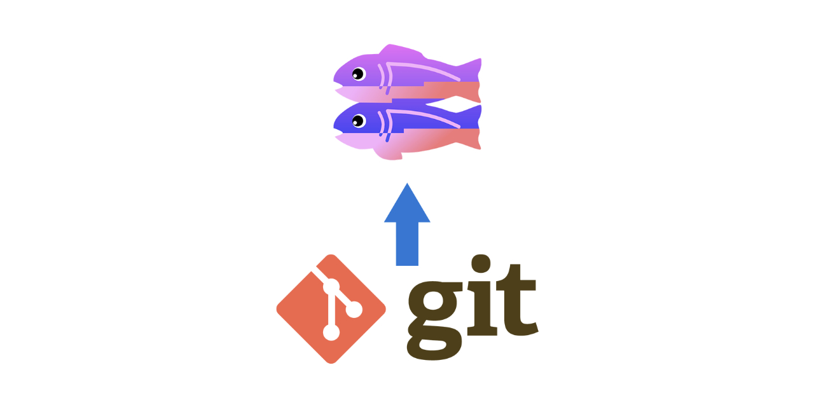

# Glitch Deploy Tool



[](https://www.npmjs.com/package/glitch-deploy-tool)

[](https://patreon.com/teamstep)

[](https://github.com/TeamSTEP/glitch-deploy-tool/blob/main/LICENSE)

> A tool that makes Glitch a bit more convenient

## Introduction

[Glitch](https://glitch.com/) is great.
But for people who use Glitch to deploy their applications, it could be better.

Glitch supports importing projects from Github, but this only allows you to import from the default branch.
There are tools like [Sync Glitch CLI](https://github.com/glitch-tools/sync-glitch-cli) which allows you to import your Github repo to Glitch via a API call.

But what if you want to import your *local files* in a specific folder?
What if you can build on the fly and use Glitch as a production server for your bots?

This is the tool for you.

Please note that this tool is still under heavy development.
You can expect things to not work as the should.

## Features

At the moment, there are two ways to upload your work to Glitch with this tool:

1. Import from Github
2. Upload local files

### Import from Github

You can automatically import your Github repository to your Glitch project.
This is done by passing the project id, Glitch user token, and the Github repository name as a query to the `/project/githubImport` endpoint.

**Pros:**

- You can start a project without cloning anything on your local machine
- You can specify a subdirectory within your repo
- Works out of the box without any configuration to your project
- Bidirectional integration if you integrate it with Github

**Cons:**

- You can't publish local builds
- You have to build everything from Glitch
- Too much bloat and CPU overhead
- You need both the project ID and the user token

### Upload local content

All Glitch projects are encapsulated in their own git repository.
With a bit of configuration, you can use your Glitch project as a remote upstream for your project.
This tool allows you to clone the project, remove everything inside, replace it with your own files and push it to origin.

**Pros:**

- Only upload the distribution build for maximum efficiency
- Works well as part of your CI workflow
- You only need your Glitch project repo URL. No tokens required
- Use your custom build script for distributing it to different servers

**Cons:**

- You need to configure your Glitch project's git settings
- It may not work well when you're interacting with the project from the browser before the local changes are pushed
- Potentially tamper your `.env` if your local changes does not include a `.ignore` file with `.env`
- You may need to create your own build script

## Installation

This is a CLI tool, so you can install it globally to use it with:

```sh
# install globally
npm install -g glitch-deploy-tool

# install locally
npm install --save glitch-deploy-tool
yarn add glitch-deploy-tool
```

Installing this as part of your project's dependency will allow you to directly interact with the `GlitchGit` and `GlitchProject` class.

### Usage

The base command for the CLI is `glitch-deploy-tool` with two sub-commands: `from-local` and `github`.

You can also pass some of the parameters from an environmental variable.

```
usage: glitch-deploy-tool from-local [OPTIONS]
options:
  Upload Local Folder Options:
    -r <glitch git url>, --remote=<glitch git url>
                                        Glitch project repository's remote URL.
                                        Environment: REPO_SOURCE=<glitch git
                                        url>
    -v, --verbose                       Verbose output. This will log all debug
                                        messages.
    -p PATH, --path=PATH                Folder to upload to Glitch.

  Tool Information:
    --version                           Print tool version and exit.
    -h, --help                          Print this help and exit.

```

```
usage: glitch-deploy-tool github [OPTIONS]
options:
  Import from Github Options:
    -t <glitch user token>, --token=<glitch user token>
                                        Glitch user API token used to access the
                                        account. Environment:
                                        GLITCH_USER_TOKEN=<glitch user token>
    -i <glitch user token>, --glitch-id=<glitch user token>
                                        Glitch project ID that will.
                                        Environment: GLITCH_PROJ_ID=<glitch user
                                        token>
    -r <user name/project name>, --repo=<user name/project name>
                                        Github repository name that will be
                                        imported to Glitch. Environment:
                                        REPO_SOURCE=<user name/project name>
    -p PATH, --path=PATH                Folder to upload to Glitch.

  Tool Information:
    --version                           Print tool version and exit.
    -h, --help                          Print this help and exit.

```

## Prerequisite

### Obtaining Glitch User Token

Glitch user tokens are essentially API tokens for making requests to Glitch.
When you log in and edit a project, your token string will be saved in your browser local storage.
So obtaining them is quite easy.

First, go to your Glitch project editor.

Second, open the developer console on your browser (either press `f12` or navigate through the settings).

Third, paste the following line of code to the console.

```js
(JSON.parse(localStorage.getItem('cachedUser'))).persistentToken
```

You should see your token being printed.

### Enable pushing to your project

Before you start using this tool, first, you need to allow pushes to your Glitch repository.
Details about this process can be found from [here](https://glitch.happyfox.com/kb/article/85-how-do-i-push-code-that-i-created-locally-to-my-project-on-glitch/).

But in short, you just have to type `git config receive.denyCurrentBranch updateInstead` on your Glitch project terminal and copy the repository link.

## Contributing

If you have suggestions for how Unity Push Checker could be improved, or want to report a bug, open an issue! We'd love all and any contributions.

For more, check out the [Contributing Guide](CONTRIBUTING.md).

## License

[MIT](LICENSE) © 2020 Hoon Kim <hoonkim@teamstep.io>